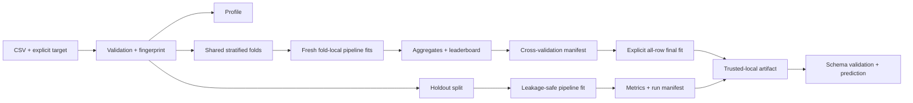

# MLForge

[](https://pypi.org/project/hivmind-mlforge/)
[](https://pypi.org/project/hivmind-mlforge/)
[](https://github.com/HivMindAI/mlforge/actions/workflows/ci.yml)
[](LICENSE)

**A reproducible Python toolkit for training, evaluating, selecting, and fitting tabular
machine-learning models with leakage-safe preprocessing and deterministic cross-validation.**

MLForge is a local, library-first workflow built on pandas and scikit-learn. It turns a CSV and an
explicit target into inspectable evidence: validated data, fair model comparisons, immutable JSON
manifests, trusted-local model artifacts, and schema-checked predictions. It is deliberately small,
single-process, and honest about what it does not implement.

## Quick start

Install the published distribution (the import package and command are both named `mlforge`):

```bash
python -m pip install hivmind-mlforge
mlforge --version
```

From a repository clone, run the bundled classification benchmark:

```bash
mlforge benchmark examples/customer_churn.csv --target churn --metric balanced_accuracy --cross-validation-folds 3 --benchmarks-dir mlbenchmarks
```

Representative output from the bundled eight-row dataset is shown below. Scores are captured from
the real command; run IDs, filesystem paths, and timing are omitted because they vary. The tiny
dataset demonstrates the workflow, not estimator quality.

```text
Protocol: 3-fold stratified cross-validation (shuffle seed=42)
Primary metric: balanced_accuracy
Leaderboard:
  1. logistic-regression:        0.833333 +/- 0.236
  2. random-forest-classifier:   0.833333 +/- 0.236
  3. dummy-classifier:           0.500000 +/- 0.000

Best observed mean: logistic-regression ranked first.
Note: cross-validation selects an estimator; it does not fit a final deployment model.
```

Final fitting is a separate, explicit decision. Copy the benchmark UUID from that command and run:

```bash
mlforge finalize examples/customer_churn.csv --target churn --benchmark-id BENCHMARK_ID --benchmarks-dir mlbenchmarks --final-models-dir mlfinalmodels --artifacts-dir artifacts
```

MLForge verifies the persisted selection and exact dataset, refits the rank-one estimator on all
rows, and creates a new immutable final-model manifest plus trusted-local artifact. The recorded
cross-validation score remains selection evidence; it is not relabeled as post-selection test
performance.


Continue with the [complete local workflow tutorial](docs/tutorial.md) to train, inspect, save,
load, and predict with a fitted artifact.

## Why MLForge

Model comparison is easy to make convincing and surprisingly hard to make fair. Preprocessing the
full dataset leaks validation information. Giving estimators different partitions makes scores
incomparable. Unstable tie-breaking makes repeated runs hard to explain. Recording only the winning
number discards the evidence needed to audit it later.

MLForge makes those concerns explicit:

| Engineering problem | MLForge boundary |
| --- | --- |
| Validation data influences imputation, scaling, or encoding | Preprocessing is fitted only on the training partition of each holdout or fold |
| Estimators are compared on different rows | Every estimator receives the same recorded partition fingerprints |
| Equivalent scores produce unstable ordering | Mean, population standard deviation, and estimator ID define deterministic ranking |
| Failed candidates disappear from the report | Expected failures remain visible in terminal immutable manifests |
| A metric cannot be connected to its inputs | Dataset hashes, configuration, seeds, versions, partitions, warnings, and metrics are persisted |
| Serialized models are treated as ordinary data | Safe inspection is separate from explicit trusted pickle loading |

The result is not an experiment-tracking platform. It is a focused reference workflow whose data,
modeling, persistence, and trust boundaries are small enough to understand and test.

## Core capabilities

### Training

- Strict local CSV validation and deterministic profiling.
- Explicit classification or regression task selection.
- Deterministic train/validation splitting and leakage-safe preprocessing.
- Five baseline estimators with task-appropriate held-out metrics.
- Versioned, create-only run manifests with failure evidence.

### Artifacts and prediction

- Fitted preprocessing and estimator saved together in a versioned `.mlforge` archive.
- Structure, schema, environment, size, lineage hash, and payload checksum inspection without
  deserializing the model.
- Explicit trusted loading for pickle-based artifacts.
- Exact feature-schema validation, column-order restoration, batch prediction, and atomic CSV
  output.

### Benchmarking

- Dummy, logistic-regression, and random-forest classification baselines by default.
- One shared holdout split, selectable primary metric, deterministic ranking, and fitted in-memory
  winner.
- A strict aggregate manifest that references every underlying run.

### Cross-validation

- Deterministic stratified 2-10 fold classification benchmarking.
- A fresh estimator and fold-local preprocessing pipeline for every training fold.
- Identical ordered fold fingerprints for every estimator.
- Per-fold metrics, arithmetic means, population standard deviations, stability-aware ranking,
  warnings, timing, and failure location.
- Selection evidence only: no nested-tuning or untouched post-selection performance claim.

### Explicit final-model fitting

- Accepts only a persisted successful cross-validation result and its exact selected dataset.
- Reconstructs the recorded preprocessing, feature-role, seed, estimator, and parameter contract.
- Fits one new preprocessing/model pipeline on every selected row without inventing new metrics.
- Writes a create-only final-model manifest and a version-2 artifact lineage record.
- Reuses safe inspection, explicit trusted loading, schema validation, and batch prediction.

## Reliability guarantees

- **Fit after split:** no data-derived transformer state is learned from validation rows.
- **Comparable evidence:** dataset bytes, target, configuration, seed, and exact partitions are
  recorded and checked before comparison.
- **Immutable local history:** run, benchmark, cross-validation, and final-model manifests are
  atomically created and never silently overwritten.
- **Bounded input handling:** CSV and artifact readers validate structure and enforce documented
  size limits.
- **Fail-closed artifact loading:** untrusted, corrupt, incompatible, or structurally invalid
  artifacts are rejected.
- **Reproducible randomness:** supported splits and randomized estimators use recorded seeds;
  random forests use one process.

Numerical results can still change when dependency versions change. Manifests record the exact
Python, MLForge, pandas, NumPy, SciPy, and scikit-learn versions so the environment can be
reconstructed and interpreted.

## Architecture



The CLI is a thin adapter over importable domain APIs. Dataset, pipeline, training, benchmark, run,
artifact, and inference modules own their behavior; none depends on a web service, database, or
worker. See [the architecture document](docs/architecture.md) for responsibilities, dependency
direction, extension points, and security boundaries.

## Python API

The same cross-validation workflow is available as a typed Python API:

```python
from pathlib import Path

from mlforge.benchmarks import (
    CrossValidationConfig,
    LocalCrossValidationStore,
    cross_validate_benchmark,
)
from mlforge.artifacts import LocalArtifactStore
from mlforge.datasets import load_csv
from mlforge.final_models import LocalFinalModelStore, fit_selected_model
from mlforge.pipelines import CrossValidationSplitConfig

dataset = load_csv(Path("examples/customer_churn.csv"), target="churn")
result = cross_validate_benchmark(
    dataset,
    CrossValidationConfig(
        primary_metric="balanced_accuracy",
        split=CrossValidationSplitConfig(fold_count=3, random_seed=42),
    ),
    store=LocalCrossValidationStore(Path("mlbenchmarks/cross-validation")),
)

print(result.manifest.winner)
print(result.manifest.to_json())

final_model = fit_selected_model(
    dataset,
    result,
    final_model_store=LocalFinalModelStore(Path("mlfinalmodels")),
    artifact_store=LocalArtifactStore(Path("artifacts")),
)
print(final_model.manifest.to_json())
print(final_model.artifact_path)
```

Cross-validation deliberately returns an immutable selection record. `fit_selected_model` is the
separate all-row refit-and-save step and never reports training-set metrics as evaluation. For the
complete workflow, see [`examples/finalize_customer_churn.py`](examples/finalize_customer_churn.py)
and the [Python API reference](docs/api.md).

## CLI

Every command provides `--help`; user-facing workflows also support `--json` where structured
output is useful.

| Workflow | Example |
| --- | --- |
| Profile | `mlforge dataset profile DATA.csv --target TARGET --json` |
| Train | `mlforge train DATA.csv --target TARGET --task classification --estimator logistic-regression --runs-dir mlruns` |
| Holdout benchmark | `mlforge benchmark DATA.csv --target TARGET --metric balanced_accuracy --runs-dir mlruns --benchmarks-dir mlbenchmarks` |
| Cross-validation | `mlforge benchmark DATA.csv --target TARGET --metric balanced_accuracy --cross-validation-folds 5 --benchmarks-dir mlbenchmarks` |
| Fit selected final model | `mlforge finalize DATA.csv --target TARGET --benchmark-id BENCHMARK_ID --benchmarks-dir mlbenchmarks --final-models-dir mlfinalmodels --artifacts-dir artifacts` |
| Inspect a run | `mlforge runs show RUN_ID --runs-dir mlruns --json` |
| Inspect an artifact safely | `mlforge artifacts inspect artifacts/RUN_ID.mlforge --json` |
| Predict from a trusted artifact | `mlforge predict artifacts/RUN_ID.mlforge FEATURES.csv --trust-artifact --output predictions.csv` |

Use `--trust-artifact` only after verifying the artifact's source and custody. Inspection and a
matching checksum do not make hostile pickle content safe.

## Installation

MLForge supports Python 3.11 and 3.12. Create an isolated environment before installation:

```bash
python -m venv .venv
python -m pip install hivmind-mlforge
```

Activate with `.venv\Scripts\Activate.ps1` on Windows PowerShell or
`source .venv/bin/activate` on macOS/Linux. For a development checkout, install the development
extra instead:

```bash
python -m pip install -e ".[dev]"
```

### Local web preview

The local single-user web interface supports the application shell, dashboard,
CSV upload, core-backed validation, explicit target selection, a real data overview, and persisted
classification comparison configuration, execution, core-backed experiment results, and explicit
rank-one model finalization. It also provides a Models screen for reviewing completed local models,
their source evidence, input schema, and recorded runtime. Finalized local models can run
schema-validated prediction CSVs, preview the first 20 results, and download the complete output.
The Experiments screen lists saved configurations and durable execution states, with links to the
existing dataset metadata, benchmark evidence, failure details, and finalized model information.
The interface uses a responsive modal navigation on smaller screens, visible keyboard focus, named
scrollable table regions, associated form guidance, and text-based status labels. Important routes
distinguish restrained loading, true empty, retryable server-error, validation-error, success, and
partial-result states; the dashboard reflects persisted experiment history rather than sample data.
Install its optional adapter and start the API from the repository root:

```bash
python -m pip install -e ".[dev,web]"
python -m mlforge.web
```

In another terminal, start the frontend:

```bash
cd frontend
npm install
npm run dev
```

Open `http://localhost:3000`. Local upload bytes and SQLite metadata are written under the ignored
`.mlforge-web/` workspace. Use Predictions to select a finalized model and submit a matching CSV.

### Private deployment profile

The repository includes a provider-neutral two-container profile for one trusted operator. It keeps
the API on an internal network, binds the browser-facing port to host loopback, persists the complete
workspace in one Docker volume, and supplies liveness/readiness probes. It must be reached through
an SSH tunnel or a reviewed private access gateway; it is not safe for direct public exposure.

See [private single-user deployment](docs/private-deployment.md) for the architecture, startup,
backup, upgrade, rollback, and security boundaries.

## Validation evidence

The v0.3.0 release has a 225-test behavioral suite and enforces a conservative 80% statement
coverage floor (83.68% measured on Python 3.12 during preparation). CI covers Ubuntu on Python
3.11/3.12 and Windows on Python 3.12, with Ruff, formatting, strict mypy, pytest, package builds,
`pip check`, and installed-wheel smoke tests. Offline real-data tests exercise scikit-learn's breast
cancer and diabetes datasets; separate release validation covers Iris, Wine, and breast cancer
cross-validation workflows.

See [release validation](docs/release-validation.md) for the dataset and clean-package boundaries.

## Documentation

- [Complete local workflow tutorial](docs/tutorial.md)
- [Python API reference](docs/api.md)
- [Architecture and design boundaries](docs/architecture.md)
- [Compatibility and versioning policy](docs/compatibility.md)
- [Artifact trust and secure-use guidance](docs/security.md)
- [Release validation](docs/release-validation.md)
- [Maintainer release procedure](docs/releasing.md)
- [Roadmap](ROADMAP.md) and [changelog](CHANGELOG.md)

## Development

Run the same quality gate used by CI:

```bash
ruff check .
ruff format --check .
mypy src tests
python -m pytest
python -m build
python -m twine check --strict dist/*
```

`python -m pytest` includes `pytest-cov` and fails below 80% statement coverage. The CI build then
installs the wheel into a separate environment and executes `scripts/wheel_smoke.py` outside the
source tree.

## Project structure

```text
mlforge/
|- src/mlforge/          # Importable production package
|  |- datasets/          # Strict ingestion and deterministic profiles
|  |- pipelines/         # Splits, folds, feature roles, and preprocessing
|  |- training/          # Baseline fitting and evaluation
|  |- benchmarks/        # Holdout/CV orchestration, ranking, and manifests
|  |- final_models/       # Verified selection lineage and explicit all-row fitting
|  |- runs/              # Immutable experiment records and comparison
|  |- artifacts/         # Trusted-local model persistence
|  `- web/               # Thin local FastAPI adapter over public core APIs
|- frontend/             # Next.js single-user web interface
|- tests/                # Unit, integration, HTTP, CLI, edge-case, and real-data tests
|- examples/             # Runnable source-checkout workflows and small CSVs
|- scripts/              # Release-tag and installed-wheel validation
|- docs/                 # Tutorial, API, architecture, security, and release guidance
`- .github/workflows/    # Cross-platform CI and trusted release publishing
```

## Project status and current limits

**MLForge v0.3.0 is the feature-complete local Python core.** The core remains stable while the
single-user web interface is delivered in small reviewable phases without redesigning its ML
algorithms or evidence model.

MLForge currently supports local, single-process tabular classification/regression. Cross-validation
and selection-driven final fitting are classification-only. The web preview has a local HTTP
dataset boundary, dashboard, upload flow, data review, classification experiment configuration,
a one-worker comparison/finalization runner with persisted job-level status, detailed
cross-validation results, safe final-model artifact metadata, and a Models screen backed by verified
local lineage. It also exposes a schema-validated prediction submission workflow for finalized
local models, bounded result previews, and complete CSV downloads. MLForge does **not**
provide hyperparameter tuning, nested
evaluation, an untouched
post-selection test estimate, regression finalization, shared storage, distributed execution,
authentication, deployment, or monitoring.

The separate core-roadmap service-infrastructure milestone is postponed and remains conditional on
real multi-user requirements; it is not active development. The
[roadmap](ROADMAP.md) records these boundaries so planned work is not presented as shipped
functionality.

## Contributing, security, and license

Read [CONTRIBUTING.md](CONTRIBUTING.md) for setup, required checks, and pull-request expectations.
Report vulnerabilities through the private process in [SECURITY.md](SECURITY.md), and review the
[artifact security model](docs/security.md) before loading or sharing model files.

MLForge is available under the [Apache License 2.0](LICENSE), including its explicit patent grant.
