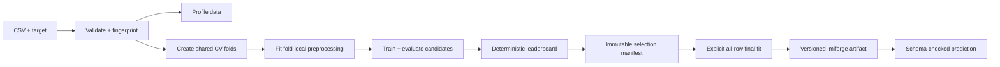
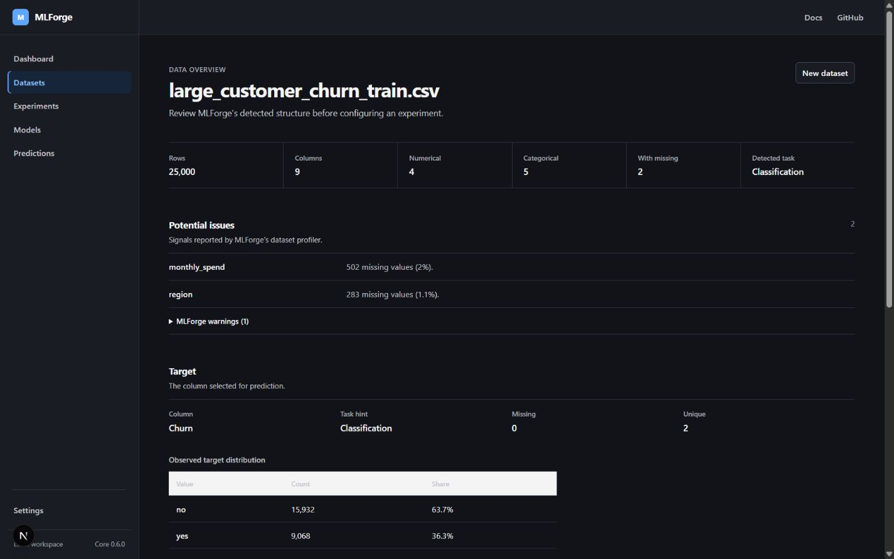
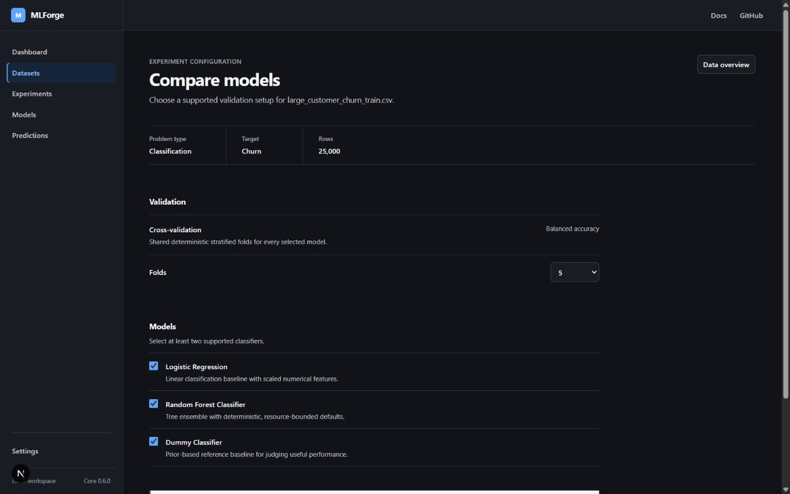
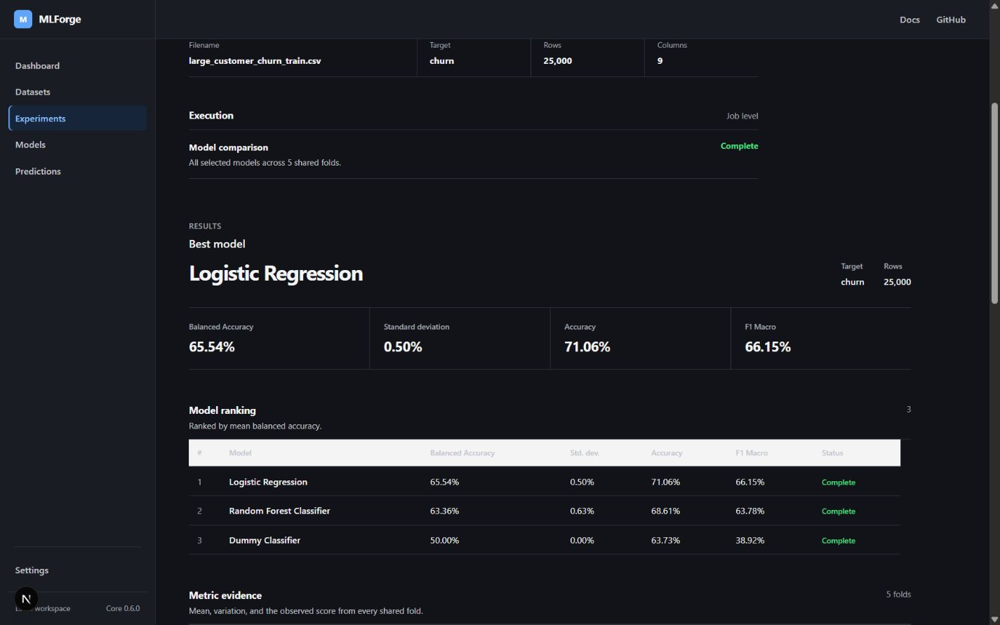
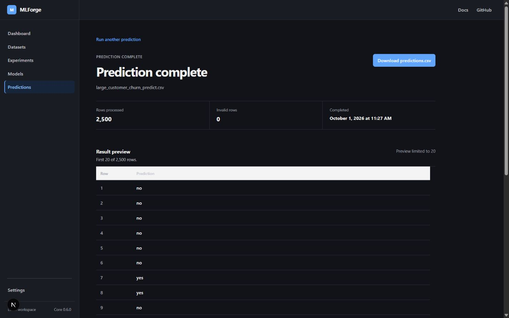

# MLForge — Reproducible ML Toolkit for Tabular Data

[](https://github.com/HivMindAI/mlforge/actions/workflows/ci.yml)
[](docs/release-validation.md)
[](https://pypi.org/project/hivmind-mlforge/)
[](https://pypi.org/project/hivmind-mlforge/)
[](LICENSE)

MLForge turns a CSV file and an explicit target column into a reproducible chain of evidence: validated data, leakage-safe model comparisons, immutable experiment records, a verified final model, and schema-checked predictions.

Created and led by **Asadullah Hussaini**; maintained under the **HivMindAI** repository and release identity.

## Abstract

MLForge is a local, end-to-end machine-learning toolkit for supervised classification and regression on tabular data. It addresses practical reproducibility failures that are easy to introduce in small and medium ML projects: preprocessing before validation, comparing models on different partitions, unstable ranking, incomplete experiment history, and model artifacts with unclear provenance.

The project provides one tested modeling core through a Python API, command-line interface, FastAPI adapter, and Next.js application. Every supported workflow records the dataset fingerprint, configuration, random seed, partitions, metrics, warnings, dependency versions, and artifact lineage needed to inspect how a result was produced.

## Motivation

A high validation score is not useful evidence when its origin cannot be reconstructed. Common tabular ML workflows can silently become unreliable when:

- imputers, scalers, or encoders learn from validation rows;
- candidate estimators receive different train/validation partitions;
- random state or tie-breaking rules are not recorded;
- failed candidates disappear from the final report;
- the selected model is evaluated and presented as though it were never selected;
- a serialized model is loaded without checking its schema, checksum, or source.

MLForge makes these boundaries explicit and testable. It favors a small, inspectable local system over a hidden or distributed execution model.

## Key Contributions

- **Leakage-safe evaluation:** preprocessing is fitted only on the training partition of each holdout split or cross-validation fold.
- **Deterministic comparison:** all estimators use the same recorded partitions, seeded randomness, direction-aware metrics, and stable tie-breaking.
- **Evidence-first tracking:** immutable JSON manifests retain configuration, hashes, versions, timings, warnings, failures, metrics, and lineage.
- **Honest model selection:** cross-validation selects an estimator; final fitting is a separate, explicit operation that does not relabel training performance as evaluation.
- **Verifiable artifacts:** `.mlforge` archives include schema, environment, lineage, size, and checksum metadata that can be inspected before trusted deserialization.
- **One core, multiple interfaces:** the Python API and CLI own the modeling behavior; FastAPI and Next.js provide a local full-stack workflow without duplicating the ML logic.

## End-to-End Workflow


```mermaid
flowchart LR
    A["CSV + target"] --> B["Validate + fingerprint"]
    B --> C["Profile data"]
    B --> D["Create shared CV folds"]
    D --> E["Fit fold-local preprocessing"]
    E --> F["Train + evaluate candidates"]
    F --> G["Deterministic leaderboard"]
    G --> H["Immutable selection manifest"]
    H --> I["Explicit all-row final fit"]
    I --> J["Versioned .mlforge artifact"]
    J --> K["Schema-checked prediction"]
```

1. Load and validate a UTF-8 CSV with an explicit target.
2. Profile columns, missing values, cardinality, distributions, and task hints.
3. Create a deterministic holdout split or shared cross-validation folds.
4. Infer feature roles and fit preprocessing independently inside each training partition.
5. Train classification or regression baselines and calculate task-appropriate metrics.
6. Rank successful candidates while preserving warnings and failure evidence.
7. Persist the complete selection protocol as an immutable manifest.
8. Explicitly refit the selected estimator on every selected row.
9. Save a versioned artifact and validate future prediction CSVs against its schema.

## Quick Start

MLForge supports Python 3.11 and 3.12. The current stable release is **v0.6.0**, published on [PyPI](https://pypi.org/project/hivmind-mlforge/). The distribution is named `hivmind-mlforge`; the import package and command are both named `mlforge`.

```bash
python -m pip install hivmind-mlforge
mlforge --version
```

From a repository checkout, run the included classification example:

```bash
mlforge dataset profile examples/customer_churn.csv --target churn

mlforge benchmark examples/customer_churn.csv \
  --target churn \
  --metric balanced_accuracy \
  --cross-validation-folds 3 \
  --benchmarks-dir mlbenchmarks
```

The benchmark prints a deterministic leaderboard and saves its complete evidence. Copy the returned benchmark UUID to perform the separate final fit:

```bash
mlforge finalize examples/customer_churn.csv \
  --target churn \
  --benchmark-id BENCHMARK_ID \
  --benchmarks-dir mlbenchmarks \
  --final-models-dir mlfinalmodels \
  --artifacts-dir artifacts
```

Run schema-validated batch inference only with an artifact whose origin and custody you trust:

```bash
mlforge predict artifacts/FINAL_MODEL_ID.mlforge \
  examples/prediction_customers.csv \
  --trust-artifact \
  --output predictions.csv
```

For a guided walkthrough, see the [complete local workflow tutorial](docs/tutorial.md).

## What MLForge Supports

| Area | Supported workflow |
| --- | --- |
| Data | Strict local CSV validation, bounded reads, fingerprints, and deterministic profiles |
| Tasks | Supervised tabular classification and regression |
| Preprocessing | Numeric imputation/scaling and categorical imputation/encoding inside the evaluation boundary |
| Evaluation | Deterministic holdout comparison and 2–10 fold cross-validation |
| Baselines | Logistic regression, dummy and random-forest classifiers; Ridge and random-forest regressors |
| Selection | Direction-aware ranking with deterministic tie-breaking and visible failures |
| Finalization | Verified selection lineage followed by an explicit all-row final fit |
| Artifacts | Versioned local archives with checksums, schema, environment, and lineage metadata |
| Inference | Exact feature-schema validation, column-order restoration, and atomic CSV output |
| Interfaces | Typed Python API, CLI, FastAPI backend, and responsive Next.js web application |
| Deployment | Local execution and a private two-container profile for one trusted operator |

## Technical Stack

- **Core:** Python 3.11+, pandas, scikit-learn
- **API:** FastAPI, Pydantic, Uvicorn
- **Web:** Next.js 16, React 19, TypeScript
- **Storage:** SQLite metadata plus immutable local files
- **Deployment:** Docker Compose with persistent workspace storage
- **Quality:** pytest, Ruff, strict mypy, Playwright, package and wheel validation

## Validation Evidence

Release validation for v0.6.0 recorded **258 passing behavioral tests** and **85.36% statement coverage**, above the enforced 80% floor. These are results from the tagged release, not a claim about every later source checkout. The suite covered ingestion, profiling, leakage-safe preprocessing, classification and regression, holdout and cross-validation comparisons, immutable manifests, artifact validation, finalization, web workflows, and prediction downloads.

CI validates:

- Ubuntu on Python 3.11 and 3.12;
- Windows on Python 3.12;
- Ruff linting and formatting;
- strict mypy type checking;
- pytest with the coverage floor;
- source and wheel builds;
- installed-wheel smoke tests; and
- a Playwright browser test of the upload-to-prediction path.

Offline integration tests also exercise scikit-learn's breast cancer and diabetes datasets. See [release validation](docs/release-validation.md) for the exact evidence and boundaries.

## Interfaces

### Python API

```python
from pathlib import Path

from mlforge.artifacts import LocalArtifactStore
from mlforge.benchmarks import (
    CrossValidationConfig,
    LocalCrossValidationStore,
    cross_validate_benchmark,
)
from mlforge.datasets import load_csv
from mlforge.final_models import LocalFinalModelStore, fit_selected_model
from mlforge.pipelines import CrossValidationSplitConfig

dataset = load_csv(Path("examples/customer_churn.csv"), target="churn")

selection = cross_validate_benchmark(
    dataset,
    CrossValidationConfig(
        primary_metric="balanced_accuracy",
        split=CrossValidationSplitConfig(fold_count=3, random_seed=42),
    ),
    store=LocalCrossValidationStore(Path("mlbenchmarks/cross-validation")),
)

final_model = fit_selected_model(
    dataset,
    selection,
    final_model_store=LocalFinalModelStore(Path("mlfinalmodels")),
    artifact_store=LocalArtifactStore(Path("artifacts")),
)

print(selection.manifest.winner)
print(final_model.artifact_path)
```

The public API returns typed results and immutable manifests. It does not require a web server, database, notebook, or background worker.

### CLI

Every command provides `--help`. User-facing workflows also support `--json` where structured output is useful.

| Workflow | Example |
| --- | --- |
| Profile | `mlforge dataset profile DATA.csv --target TARGET --json` |
| Train | `mlforge train DATA.csv --target TARGET --task classification --estimator logistic-regression` |
| Holdout comparison | `mlforge benchmark DATA.csv --target TARGET --metric balanced_accuracy` |
| Cross-validation | `mlforge benchmark DATA.csv --target TARGET --metric balanced_accuracy --cross-validation-folds 5` |
| Final fit | `mlforge finalize DATA.csv --target TARGET --benchmark-id BENCHMARK_ID` |
| Inspect a run | `mlforge runs show RUN_ID --json` |
| Inspect an artifact | `mlforge artifacts inspect artifacts/MODEL_ID.mlforge --json` |
| Predict | `mlforge predict artifacts/MODEL_ID.mlforge FEATURES.csv --trust-artifact --output predictions.csv` |

### Local Web Application

The single-user web interface provides:

- CSV upload, validation, profiling, and explicit target selection;
- classification and regression experiment configuration;
- durable execution states and detailed cross-validation results;
- explicit rank-one model finalization;
- a local model registry with lineage, schema, and runtime versions;
- schema-validated prediction upload, preview, and CSV download;
- browser-local appearance and experiment defaults;
- workspace diagnostics, usage counts, and create-only backup download.

These screenshots were captured from one real local application run using the deterministic
synthetic customer-churn data produced by
[`scripts/generate_portfolio_demo_data.py`](scripts/generate_portfolio_demo_data.py). The training
CSV contains 25,000 rows with target `churn`; the target-free prediction CSV contains 2,500 rows.
The run compares Logistic Regression, Random Forest Classifier, and Dummy Classifier with balanced
accuracy across five shared stratified folds. They are not mockups.

| Dataset overview | Experiment configuration |
| --- | --- |
|  |  |
| Model comparison | Prediction interface |
|  |  |

Install the optional web dependencies and start the API from the repository root:

```bash
python -m pip install -e ".[dev,web]"
python -m mlforge.web
```

In another terminal:

```bash
cd frontend
npm install
npm run dev
```

Open `http://localhost:3000`. The ignored `.mlforge-web/` directory stores uploaded files, immutable evidence, artifacts, predictions, and SQLite metadata. The web workspace is deliberately separate from CLI output directories.

## Reproducibility and Security Boundaries

MLForge provides the following guarantees inside its supported workflow:

- **Fit after split:** data-derived preprocessing state is never learned from validation rows.
- **Comparable evidence:** candidates receive the same recorded dataset, seed, and partitions.
- **Immutable history:** run, benchmark, cross-validation, and final-model manifests are created once and never silently overwritten.
- **Reproducible randomness:** supported splits and randomized estimators use recorded seeds; random forests use one process.
- **Bounded input handling:** CSV and artifact readers validate structure and enforce documented size limits.
- **Fail-closed loading:** corrupt, incompatible, structurally invalid, or explicitly untrusted artifacts are rejected.

Dependency versions can still affect numerical results. Every manifest records the relevant Python, MLForge, pandas, NumPy, SciPy, and scikit-learn versions.

`.mlforge` artifacts contain a Python pickle payload. Metadata inspection does not deserialize that payload, but checksums do not make hostile pickle data safe. Use trusted loading only for artifacts created and kept within a trusted workflow. See the [artifact security model](docs/security.md).

## Scope and Limitations

MLForge v0.6.0 is a **feature-complete local product in maintenance mode**. Its intended boundary is one trusted operator running tabular classification or regression on a local machine or through the private deployment profile.

It deliberately does not claim to provide:

- automated hyperparameter optimization;
- nested evaluation or an untouched post-selection test estimate;
- distributed or GPU training;
- shared experiment storage or multi-user isolation;
- request authentication or safe direct public exposure;
- public online model serving; or
- production drift detection and observability.

These are product boundaries, not hidden roadmap promises. Shared-service and multi-user infrastructure remain conditional on demonstrated requirements. See the [roadmap](ROADMAP.md).

## Private Deployment

The repository includes a provider-neutral two-container profile for one trusted operator. The API remains on an internal network, the browser-facing port binds to host loopback, the complete workspace is persisted in one Docker volume, and both containers provide health checks.

Access it through an SSH tunnel or a reviewed private gateway. It is not designed for direct public exposure. See [private single-user deployment](docs/private-deployment.md) for startup, backup, upgrade, rollback, and security guidance.

## Project Structure

```text
mlforge/
|- src/mlforge/          # Importable production package
|  |- datasets/          # Strict ingestion and deterministic profiles
|  |- pipelines/         # Splits, folds, feature roles, and preprocessing
|  |- training/          # Baseline fitting and evaluation
|  |- benchmarks/        # Holdout/CV orchestration, ranking, and manifests
|  |- final_models/       # Selection verification and explicit all-row fitting
|  |- runs/              # Immutable experiment records and comparison
|  |- artifacts/         # Trusted-local model persistence
|  `- web/               # Thin FastAPI adapter over the public core APIs
|- frontend/             # Next.js single-user web interface
|- tests/                # Unit, integration, HTTP, CLI, and real-data tests
|- examples/             # Runnable workflows and small example CSVs
|- scripts/              # Release validation and deterministic demo-data generation
|- deployment/           # Backend and frontend container definitions
|- docs/                 # Architecture, tutorial, security, and release guidance
`- .github/workflows/    # Cross-platform CI and trusted release publishing
```

## Development

Create an isolated environment and install the development dependencies:

```bash
python -m venv .venv
python -m pip install -e ".[dev,web]"
```

Run the Python quality gate:

```bash
ruff check .
ruff format --check .
mypy src tests
python -m pytest
python -m build
python scripts/check_source_archive.py dist
python -m twine check --strict dist/*
```

Run the frontend quality gate:

```bash
cd frontend
npm install
npm run lint
npm run build
npx playwright install chromium
npm run test:e2e
```

See [CONTRIBUTING.md](CONTRIBUTING.md) for the complete contributor workflow.

## Documentation

- [Complete local workflow tutorial](docs/tutorial.md)
- [Python API reference](docs/api.md)
- [Architecture and design boundaries](docs/architecture.md)
- [Compatibility and versioning policy](docs/compatibility.md)
- [Artifact trust and secure-use guidance](docs/security.md)
- [Release validation](docs/release-validation.md)
- [Private deployment guide](docs/private-deployment.md)
- [Maintainer release procedure](docs/releasing.md)
- [Roadmap](ROADMAP.md)
- [Changelog](CHANGELOG.md)
- [Citation metadata](CITATION.cff)

## Author

**Asadullah Hussaini** — Creator & Lead Developer

MLForge is an independent software and machine-learning engineering project designed, developed,
tested, documented, and released under his leadership.

**HivMindAI** is the repository and release-maintainer identity. It is not presented as a second
human author.

The already-published PyPI v0.6.0 files are immutable and still display their original
`Author: HivMindAI` metadata and release-candidate wording. This repository correction does not
rewrite those artifacts; the source metadata now records Asadullah Hussaini as author and HivMindAI
as maintainer for the next legitimate release.

## Citation

Use the repository's [Citation File Format metadata](CITATION.cff) to cite MLForge. GitHub uses this
file to provide the repository's **Cite this repository** entry.

## License and Security

MLForge is available under the [Apache License 2.0](LICENSE). Report vulnerabilities through the private process described in [SECURITY.md](SECURITY.md); do not open public issues for suspected security problems.
