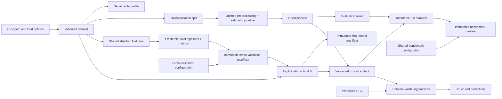

# MLForge Target Architecture

## Status and scope

This document distinguishes the implemented local workflow from later target capabilities. The
current implementation includes packaging, typed application configuration, domain errors,
explicit CLI-owned logging, validated local CSV ingestion, deterministic profiling, task-aware
splitting, leakage-safe preprocessing, five baseline estimators, held-out evaluation, immutable
local run manifests, compatible-run comparison, shared-fold classification benchmarking, explicit
selection-driven all-row fitting, trusted-local fitted artifacts, schema-validated batch inference,
and thin CLI adapters.

MLForge's first product boundary is local tabular supervised machine learning. A user supplies a
CSV dataset and explicit target, trains a classification or regression pipeline, receives metrics
and a reproducible run record, and applies a trusted fitted artifact to compatible tabular data.

Distributed training, notebooks, arbitrary DAG orchestration, deep-learning frameworks, online
feature stores, and automatic deployment are outside the initial scope.

## Design principles

1. **Library first.** Every useful operation is an importable, testable Python API. The CLI only
   parses input, calls application functions, and renders results.
2. **Fit after split.** No data-derived preprocessing state may be learned before train/validation
   separation.
3. **Explicit inputs and outputs.** Typed configuration and result objects replace hidden globals
   and process-wide mutable state.
4. **Reproducibility over magic.** Run, selection, final-model, and artifact records capture data
   identity, configuration, dependency versions, random seeds, metrics where meaningful, warnings,
   and explicit lineage hashes.
5. **Local before distributed.** Filesystem implementations establish semantics before database,
   queue, API, or object-storage adapters are considered.
6. **Small public surface.** APIs become public only after their behavior is exercised by the
   end-to-end workflow.
7. **Trust is not implied.** Serialized Python model artifacts are code-execution boundaries and
   must never be loaded from untrusted sources.

## Data flow



The run manifest is the lineage anchor. It records a data fingerprint, the effective
training configuration, split outcome, evaluation results, dependency versions, timestamps,
warnings, and terminal status. It does not copy a dataset, contain a fitted model, or silently
mutate an earlier run. A fitted artifact uses its successful run UUID as identity and records the
canonical run-manifest SHA-256, preserving a one-way reference without mutating the run record.
Cross-validation is a separate evidence path: every estimator uses the same ordered fold
fingerprints, but preprocessing and model state are fitted independently within each training
fold. Its aggregate does not represent one fitted pipeline. Explicit final fitting verifies that
selection and dataset, reconstructs the winning contract, fits every selected row, and creates a
new immutable lineage anchor without inventing a performance metric.

## Package responsibilities

| Package/module | Status | Responsibility | Must not own |
| --- | --- | --- | --- |
| `mlforge.datasets` | Implemented | CSV validation/loading, schema metadata, target checks, profiling | Model fitting or artifact writes |
| `mlforge.pipelines` | Implemented | Task-aware splitting, feature roles, and construction of unfitted leakage-safe transformers/model pipelines | Estimator fitting, metric decisions, CLI rendering, or run persistence |
| `mlforge.training` | Implemented | Baseline estimator selection, complete pipeline fitting, held-out prediction and task metrics | Run storage, model serialization, or database/HTTP concerns |
| `mlforge.runs` | Implemented | Run identity, strict versioned manifests, create-only atomic local storage, compatible-run comparison | Fitting estimators or storing model binaries |
| `mlforge.benchmarks` | Implemented | Holdout and shared-fold classification orchestration, explicit-metric ranking, failure evidence, fitted holdout winner selection, and immutable aggregate storage | Estimator implementations, deployment fitting, service infrastructure, or UI rendering |
| `mlforge.final_models` | Implemented | Persisted CV-selection verification, exact-dataset revalidation, all-row classification fitting, terminal manifests, and failure evidence | Metric estimation, arbitrary estimator tuning, artifact bytes, or service infrastructure |
| `mlforge.artifacts` | Implemented | Versioned manifests, atomic archives, integrity checks, exact-environment and explicit-trust loading | Metric decisions, remote provenance, or deployment |
| `mlforge.inference` | Implemented | Raw feature-schema validation and structured dataframe/CSV batch prediction | Training or online serving infrastructure |
| `mlforge.config` | Implemented | Immutable application settings and explicit source precedence | Environment reads at import time |
| `mlforge.errors` | Implemented | Stable domain exceptions with actionable context | Logging or process exits |
| `mlforge.logging_config` | Implemented | Explicit entrypoint setup for package-owned log records | Import-time or global-root setup |
| `mlforge.cli` | Implemented | Argument parsing, configuration, presentation, exit codes | ML or persistence implementation |

Modules will be added only in their roadmap milestone. A directory tree is not an architecture by
itself, so empty packages and placeholder interfaces are intentionally avoided.

## Dependency direction

The CLI depends on application-facing functions. Application functions compose dataset, pipeline,
training, run, benchmark, final-model, artifact, and inference modules. Core modules may use shared
configuration and domain errors, but shared modules must not import the CLI or future
infrastructure adapters.

Initial external dependencies should remain narrow:

- the standard library for configuration, JSON manifests, paths, hashing, and atomic local writes;
- pandas `>=3.0,<4` for implemented CSV loading and tabular profiling;
- scikit-learn `>=1.9,<2` for implemented splitting, preprocessing, baseline estimators, and
  metrics.

A future API, SQL repository, experiment tracker, worker, or object store will implement an adapter
outside the core modules. Core behavior must continue to work without those dependencies installed.

## Public API direction

The implemented dataset API is:

```python
from mlforge.datasets import CsvLoadOptions, load_csv, profile_dataset

dataset = load_csv(path, target="label", options=CsvLoadOptions())
profile = profile_dataset(dataset)
profile_json = profile.to_json()
```

The implemented pipeline API is:

```python
from sklearn.linear_model import LogisticRegression

from mlforge.pipelines import TaskType, build_model_pipeline, split_dataset

split = split_dataset(dataset, task=TaskType.CLASSIFICATION)
pipeline = build_model_pipeline(split, LogisticRegression())
pipeline.fit(split.train_features, split.train_target)
```

The builder clones the estimator and returns an unfitted scikit-learn `Pipeline`. Model fitting is
caller-owned at this lower level.

The implemented user-level training, artifact, and inference APIs are:

```python
from pathlib import Path

from mlforge.artifacts import LocalArtifactStore
from mlforge.inference import predict_csv
from mlforge.pipelines import TaskType
from mlforge.runs import LocalRunStore, compare_runs
from mlforge.training import LOGISTIC_REGRESSION, TrainingConfig, train

store = LocalRunStore(Path("mlruns"))
config = TrainingConfig(task=TaskType.CLASSIFICATION, estimator=LOGISTIC_REGRESSION)
first = train(dataset, config, run_store=store)
second = train(dataset, config, run_store=store)
comparison = compare_runs(
    (first.manifest, second.manifest),
    metric="balanced_accuracy",
)

artifact_store = LocalArtifactStore(Path("artifacts"))
saved = artifact_store.save(first)
trusted = artifact_store.load(first.manifest.run_id, trusted=True)
predictions = predict_csv(trusted, Path("prediction.csv"))
```

The implemented local benchmark composes the same training service:

```python
from pathlib import Path

from mlforge.benchmarks import BenchmarkConfig, LocalBenchmarkStore, benchmark
from mlforge.runs import LocalRunStore

result = benchmark(
    dataset,
    BenchmarkConfig(primary_metric="balanced_accuracy"),
    run_store=LocalRunStore(Path("mlruns")),
    benchmark_store=LocalBenchmarkStore(Path("mlbenchmarks")),
)
winner = result.winner
```

The aggregate manifest references but never mutates each terminal run. All estimators use the same
split and preprocessing configuration; strict compatible-run comparison verifies the exact source
and partition before ranking. A deterministic evidence layer reports the selected metric, observed
duration, and failures. The current single-holdout result is intentionally described as the best
observed result under that protocol, not as universal model superiority or cross-validation
stability.

The cross-validation application path is independent of ordinary run storage:

```python
from pathlib import Path

from mlforge.benchmarks import (
    CrossValidationConfig,
    LocalCrossValidationStore,
    cross_validate_benchmark,
)
from mlforge.pipelines import CrossValidationSplitConfig

result = cross_validate_benchmark(
    dataset,
    CrossValidationConfig(split=CrossValidationSplitConfig(fold_count=5)),
    store=LocalCrossValidationStore(Path("mlbenchmarks/cross-validation")),
)
winner = result.manifest.winner
```

This winner is an immutable selection record, not a fitted pipeline. Each fold constructs a new
pipeline around a fresh estimator clone, fits it only on training rows, and evaluates its paired
validation rows. Final fitting is a separate explicit application service:

```python
from mlforge.artifacts import LocalArtifactStore
from mlforge.final_models import LocalFinalModelStore, fit_selected_model

final_model = fit_selected_model(
    dataset,
    result,
    final_model_store=LocalFinalModelStore(Path("mlfinalmodels")),
    artifact_store=LocalArtifactStore(Path("artifacts")),
)
```

The service accepts only the persisted rank-one cross-validation result. It revalidates the source
and in-memory dataset, reconstructs the exact selected preprocessing and estimator parameters,
fits every selected row, and writes a new final-model manifest. It never evaluates the pipeline on
its own training rows or copies cross-validation values into a new metric field.

`TrainingResult.pipeline` is fitted and usable in the current process, and its artifact persistence
remains a separate explicit operation. The final-model application service coordinates its own
immutable fit record and prediction-ready artifact because producing both is its declared outcome.
Trusted loading remains a separate opt-in at the call site.

Configuration and result objects should be serializable and typed. Lower-level helpers stay in
their owning modules instead of being re-exported automatically from `mlforge`.

The CLI should map directly to the same operations and offer machine-readable JSON where useful.
It must translate known domain errors into stable nonzero exit codes without swallowing tracebacks
unexpectedly during development.

## Extension points

MLForge should first accept objects that already follow scikit-learn's estimator conventions. This
allows custom estimators without a new plugin framework. A formal protocol is justified only when
MLForge needs behavior not expressed by that convention.

Storage interfaces should be extracted only after a second implementation exists or is immediately
required. The local run/artifact store defines behavior first; database and object-storage adapters
must then pass the same contract tests.

Dataset readers, metric registries, and event hooks should follow the same rule: prefer an explicit
callable or existing ecosystem interface before inventing discovery, global registration, or
import-time plugin loading.

## Errors, logging, and configuration

- Domain code raises specific exceptions containing safe, actionable context; it never calls
  `sys.exit`.
- The CLI owns exit codes and presentation. Future HTTP adapters own status codes and response
  schemas.
- Libraries emit log records but do not configure handlers during import. The CLI explicitly
  configures the `mlforge` logger without taking ownership of the global root logger.
- `ApplicationConfig` resolves defaults, then the process environment, then explicit entrypoint
  overrides. `MLFORGE_LOG_LEVEL` is the only setting currently implemented.
- `CsvLoadOptions` carries encoding, delimiter, and maximum file size explicitly beside each load.
  These data-specific options are not process environment settings.
- Configuration is passed explicitly after entrypoint resolution and must not create hidden
  behavior in core functions.
- Run manifests record effective configuration after validation, with secrets excluded by design.

## Security and reliability boundaries

CSV inputs are untrusted data. The implemented loader resolves a local path, requires a regular
`.csv` file, rejects empty and oversized inputs before parsing, decodes text strictly, checks blank
and duplicate headers, verifies every nonblank row has the exact header width, rejects malformed
quoting and null bytes, and calculates a SHA-256 fingerprint. The default 100 MiB ceiling is a
resource guard, not an out-of-core implementation: pandas still loads accepted data into memory.
Values are treated only as data and are never evaluated. User-provided output paths in future
milestones must be resolved deliberately and writes should be atomic.

## Dataset profile semantics

The loader intentionally leaves missing values in place so the profile can expose them. It does
not impute, encode, normalize, split, or fit anything. Dates are not guessed during CSV loading;
reported column kinds are the physical dtypes pandas inferred from the file.

Profile facts include rows, columns, raw-file hash, missing cells, duplicate rows, non-missing and
unique counts, and finite numeric summaries. Infinite numeric values are counted separately so JSON
never contains non-standard `NaN` or `Infinity` values.

Profile warnings are conservative heuristics:

- high cardinality means a string/categorical column has at least 50 distinct non-missing values
  and at least 50% uniqueness;
- a likely identifier must be complete, fully unique, and have an ID/key-like name;
- numeric targets are classification-like only when their distinct count is small relative to the
  square root of the non-missing row count, capped at 20; strings and booleans are
  classification-like;
- class imbalance is warned when the smallest class has less than 20% of the largest class count.

These hints help a developer inspect data. They do not choose a task, discard a column, repair a
target, or authorize training automatically.

## Split and preprocessing semantics

`split_dataset` is the boundary between validated source data and supervised ML inputs. It verifies
that the dataframe still matches ingestion metadata, removes the named target before splitting,
preserves original row indices, shuffles with an explicit seed, and returns copied train and
validation frames/series. Classification is stratified by default; regression is not. Users may
explicitly disable classification stratification for exploration, but an unusable one-class
training partition is still rejected.

Every non-target input column becomes a feature. MLForge reports likely identifiers but does not
silently discard them or infer domain-specific leakage, so callers must prepare model-ready CSVs
without identifiers, timestamps, post-outcome fields, or other columns that should not influence
the model.

Targets must be one-dimensional and complete. Classification needs at least two classes, with at
least two samples per class when stratifying and enough room for each class in both partitions.
All numeric targets must be finite. Regression targets must additionally be numeric and
non-boolean. MLForge does not silently delete rows, impute labels, bin regression targets, or adjust
a requested split fraction.

Preprocessing is constructed from `split.train_features`. Numeric columns use configurable mean or
median imputation, retain all-missing columns with stable positions, and are standardized by
default. Boolean, string, object, and pandas categorical columns use constant imputation followed
by `OneHotEncoder(handle_unknown="ignore")`. The categorical missing marker is rejected if it is
already a real category in either split partition, avoiding a silent value merge. Non-finite
numeric feature values are rejected before fitting because the documented transformer chain cannot
process them safely; missing numeric values remain supported through imputation.

Automatic feature roles use only physical pandas dtypes. `FeatureOverrides` resolves genuine
ambiguity, notably all-missing categorical columns that CSV inference represents as floating-point;
forcing a column numeric still requires an actual numeric dtype. Datetimes and other unsupported
dtypes fail explicitly because meaningful feature extraction is domain-specific.

The returned `ColumnTransformer` or model `Pipeline` is unfitted. The caller must fit it only on
training rows and transform/predict validation rows afterward. Keeping preprocessing and estimator
in one pipeline also makes later cross-validation and artifact serialization less error-prone.

## Training, evaluation, and run semantics

`TrainingConfig` explicitly pairs a task with one of five named baselines: dummy prior, logistic
regression, or random forest for classification, and ridge regression or random forest for
regression. Invalid task/estimator combinations fail during configuration. Both split and
estimator randomness use the recorded seed, and random forests use `n_jobs=1` for a stable local
execution contract. MLForge does not yet expose arbitrary estimator parameters, tuning,
  hyperparameter tuning or a plugin registry; the lower-level pipeline builder remains the
  extension point for compatible custom estimators. Cross-validation uses stratified folds for
  classification and ordinary deterministic shuffled K-folds for regression so continuous targets
  are never silently binned.

`train` profiles and splits the validated dataset, constructs one preprocessing-and-estimator
pipeline, fits it only on training rows, and predicts the held-out rows. Classification records
accuracy, balanced accuracy, macro and weighted F1, macro precision, and macro recall. Regression
records mean absolute error, R-squared, and root mean squared error. Every recorded metric must be
finite; regression evaluation therefore requires at least two validation rows. The service returns
a fitted in-memory pipeline only after its successful terminal manifest is stored.

A `RunManifest` is a frozen, schema-versioned JSON value. It captures the effective configuration
and estimator parameters, CSV parser choices, dataset identity and dimensions, environment
versions, requested and actual split policy, an exact row-partition fingerprint, warnings,
metrics, timestamps, and either a successful or failed terminal outcome. Expected fitting,
preprocessing, and evaluation errors produce a failed manifest before
`TrainingFailedError` is raised. Invalid configuration fails before a run starts and storage faults
remain storage faults rather than being mislabeled as model failures.

`LocalRunStore` accepts canonical UUID run IDs, limits reads to regular UTF-8 JSON files of at most
1 MiB, fully validates the manifest schema, and uses a create-only atomic filesystem link so an
existing record cannot be overwritten. Run comparison requires at least two unique successful
runs with the same task, source fingerprint, target, validation fraction, seed, actual
stratification policy, and exact row partition. Ranking direction comes from the recorded metric
metadata, not its name.

`benchmark` composes `train` for at least two unique classification estimators under one shared
configuration. The dummy classifier is a required default reference point, not a candidate that is
silently excluded from ranking. Strict run comparison verifies the same dataset and exact row
partition before a user-selected metric determines rank; estimator identifiers break score ties so
random run UUIDs cannot change the winner. Per-estimator wall time is observational evidence and
does not affect rank. Expected estimator failures keep their failed run manifests and appear
unranked in the aggregate; if every estimator fails, the aggregate is written before
`BenchmarkFailedError` is raised.

`BenchmarkManifest` has an independent schema version and create-only `LocalBenchmarkStore`. It
records the effective shared configuration, dataset and split snapshots, metric direction, rank,
duration, failure summaries, and underlying run UUIDs. `BenchmarkResult` retains successful fitted
pipelines so its rank-one `TrainingResult` can be saved explicitly as an artifact. This fast
development protocol uses one holdout partition.

`cross_validate_benchmark` uses deterministic shuffled `StratifiedKFold` partitions for 2-10
folds. The minimum target-class population must be at least the requested fold count. Each source
row occurs in validation exactly once, train and validation indices are disjoint, and every
estimator receives the same ordered partition SHA-256 values. Estimators and preprocessing are
freshly cloned and fitted per training fold, so validation rows cannot affect learned transformer
or model state.

Every classification metric is stored as ordered fold values, arithmetic mean, and population
standard deviation. Ranking uses the primary mean in its declared direction, lower standard
deviation as a stability tie-breaker, and estimator identifier as the final deterministic
tie-breaker; duration never affects rank. An estimator failure records the fold number, exact
partition, completed fold prefix, and safe error details. Other estimators continue, and an
all-failed aggregate is persisted before `BenchmarkFailedError` is raised.

`CrossValidationManifest` has its own schema version and create-only
`LocalCrossValidationStore`. It is selection evidence and intentionally does not contain or return
a fitted winner. Hyperparameter tuning, nested evaluation, confidence intervals, and resource
isolation remain separate policies; the ordinary fold mean must not be presented as an untouched
post-selection test estimate.

## Final-model semantics

`fit_selected_model` requires a validated `CrossValidationResult` whose regular-file manifest still
matches its in-memory value and benchmark UUID. The supplied `LoadedDataset` must match the
selection's SHA-256, byte size, dimensions, target, encoding, and delimiter. Its columns, dtypes,
row count, and dataframe values must still match ingestion metadata and a fresh read of the source.

The service reconstructs the selected preprocessing, feature overrides, random seed, estimator,
and shallow estimator parameters. Any drift stops before fitting. A new preprocessing/model
pipeline then learns from every selected row. `FinalModelManifest` records its own UUID, terminal
status, exact selection and fold-plan digests under `selection_evidence`, dataset and environment
snapshots, a metric-free `final_fit` block with `fit_scope=all_rows`, the intended artifact identity
and executable-payload SHA-256/size, warnings, and safe failure details. It has an independent
create-only `LocalFinalModelStore`. Successful records contain no final-model metrics because
training-set scores would not be evaluation evidence. The service returns only after the existing
artifact store has persisted and reverified the matching prediction-ready archive.

## Artifact and inference semantics

`LocalArtifactStore` publishes one create-only `<model-id>.mlforge` archive per successful evaluated
run or final model. The temporary archive is fully written and flushed before a same-filesystem hard link atomically makes
the final name visible. The archive contains exactly `manifest.json` and `pipeline.pkl` as stored,
unencrypted ZIP members; nothing is extracted. Its strict versioned manifest records the ordered
raw feature names, training pandas dtypes, numeric/categorical roles, target, task, categorical
missing marker, exact runtime versions, pipeline size and SHA-256, and canonical lineage-manifest
SHA-256. Version 1 preserves evaluated training-run lineage. Version 2 records a generic model ID
and explicit `final-model` lineage kind. Saving first verifies that the result still matches its
persisted immutable run or final-model record.

Safe inspection bounds the archive and member sizes, rejects unexpected structure, parses the JSON
schema, and streams the pipeline payload through SHA-256 without deserializing it. Trusted loading
is a distinct operation whose default is refusal. It requires an explicit `trusted=True`, requires
exact Python/MLForge/pandas/NumPy/SciPy/scikit-learn versions before deserialization, treats
scikit-learn version warnings as errors, and checks the loaded fitted pipeline's feature names
against the manifest.

The standard-library protocol-5 pickle is sufficient for the implemented pipeline and adds no
dependency. Like joblib and cloudpickle, pickle can execute arbitrary code during loading.
Integrity detects changes relative to a manifest but does not authenticate that manifest or make
hostile content safe. The local caller must establish source trust; production provenance,
signing, isolation, and access control are separate operational concerns documented in
`docs/security.md`.

`predict_frame` accepts only a `LoadedArtifact`, requires an exact unique feature-name set, restores
training order, validates each numeric/categorical role, rejects infinite numeric values and
reserved missing-marker collisions, and returns finite JSON scalar predictions with stable
one-based row numbers. `predict_csv` first applies the existing strict local CSV validation without
inventing a target column. Unknown categorical values remain supported by the fitted encoder;
missing or extra features fail before model execution.

`write_predictions_csv` is the inference output adapter. It writes the existing structured result
without repeating model loading or prediction, creates parent directories, publishes through a
temporary same-directory file and hard link, and refuses to overwrite an existing destination.

Failures must not produce a successful run state or half-written manifest. Randomness must use
recorded seeds. Raw datasets, secrets, fitted artifacts, and prediction data remain ignored by Git
and are never embedded in normal logs.

## Testing strategy

- **Unit tests** cover validation, profiling rules, configuration, metrics, manifests, and error
  behavior with small deterministic fixtures.
- **Integration tests** exercise CSV-to-profile behavior, real scikit-learn preprocessing/model
  pipelines, all five MLForge training baselines, holdout and cross-validation benchmark
  orchestration, fold-local preprocessing boundaries, all-row final fitting, artifact save/load
  parity, schema-validated dataframe/CSV prediction, CLI workflows, and bundled runnable examples.
- **Interface tests** pin public function signatures, serialized schema versions, CLI output/exit
  behavior, and storage adapter contracts.
- **Edge-case tests** cover malformed data, tiny datasets, missing values, unknown categories,
  incompatible schemas, changed selection/data lineage, failed training/final fitting, corrupt
  artifacts, and atomic-write recovery.
- **Packaging tests** install the built wheel into a clean environment and run import/CLI smoke
  checks.
- **Static checks** run Ruff and strict mypy against both production and test code on every
  supported Python version in CI.

Tests should assert externally meaningful behavior rather than mirror private implementation steps.

## Development versus production

The development product is a single-process local library and CLI with filesystem run, benchmark,
final-model, and trusted-artifact storage plus batch inference. Its trust decision is local and
explicit; it does not claim remote provenance, adversarial execution isolation, online serving,
or an untouched performance estimate after selection.

A production multi-user product would additionally need transactional persistence, isolated job
execution, access control, secret management, shared artifact storage, rate/resource limits,
observability, migrations, backup/recovery, and deployment automation. Those concerns belong in
adapters after the local contracts are stable; they should not be simulated by placeholder code in
the core package.

## Common architectural mistakes to avoid

- fitting preprocessing on the entire dataset before validation splitting;
- separating a serialized estimator from the preprocessing and schema it requires;
- using global registries or environment-dependent imports as an extension mechanism;
- coupling core operations to argparse, HTTP, SQLAlchemy, Celery, or a specific tracker;
- treating a checksum, file extension, or `trusted=True` flag as proof that pickle content is safe;
- recording only metrics while omitting data identity, effective configuration, seeds, and versions;
- adding infrastructure because it appears on an MLOps checklist rather than because a supported
  workflow requires it.
